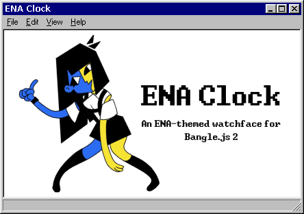
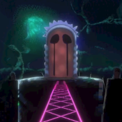

<!-- Try importing terminal font -->

# ENA Clock

Meet the (un)official ENA watchface for Bangle.js 2, inspired by Joel Guerra's popular [ENA series!](https://www.youtube.com/watch?v=xUwJWv38FpY&list=PLhPaJURyApsoMQDaoft5t0l0iAwUOLtlM&index=2)

In anticipation for the release of *ENA: Dream BBQ*, I've decided to make a watchface that honors ENA's first season.

## Enjoy these sceneic views of the ENAverse!

Hourglass Meadow (Beach)

<!-- Dead God Graveyard (Door to the Great Runas)

 -->

## Planned watchfaces & content
- Watchface: Hourglass Meadow (Hills)
- Watchface: Mannequin Expanse
- Watchface: Overworld
- Watchface: Maze
- Watchface: Desert
- Watchface: Stairway Void
- Watchface: Hourglass Meadow (Garden)
- Content: Animated characters, including (but not limited to) ENA and Moony
- Content: Lots of stuff from Season 2!

## Usage

Install, and select as your default watch face. That's it!

## Features

- Telling time in a very fashonable manor

## Requests

Feel free to contact me with any questions or ideas regarding this watchface! Contact links are provided on my [GitHub Page](https://github.com/BraidenPsiuk).

## Credits

This is a fan-made watchface created by [Braiden Psiuk](https://github.com/BraidenPsiuk). It has no official association with [Joel Guerra](https://joelgc.com/) or the ENA production team. Please support their works by purchasing official merch or donating to their [Patreon page!](https://www.patreon.com/joelg) 

---

###### 01000110 01001111 01010010 01000111
###### 01000101 01010100 00100000 01011001
###### 01001111 01010101 01010010 00100000
###### 01010000 01000001 01010011 01010100

<!-- FORGET YOUR PAST -->

<!-- 
    markdown color font styles
 -->

<!-- Ena head icon compressed:
require("heatshrink").decompress(atob("mEwwcCpMkyQCMggFDoAjJyVICIg1KiQRBwQRByARKgVIkhHCwBaLpMgCIRsMhJcCkARMgIRCSBoRCpCjOCOqzBCPT9KCIsCCJUAyQMDCKTuBZoPbtu27dgCI8SCKlPCIYMDCImSvARBpwRDI5GT/BzBCINvCIsSCIef/AHBCIP+gEbCI8E/4RBgV+74RBgYRHg4RDu3/CIIAECIMCpEkCIWSuxZC7ARFPQRZCyf2CI7ABRgdYCgJoBCJgmCCJQOCCI/QEZefCIfACIr4BWAIUCvwRJgFACJoPBWYQRDr3YCJSeBCIVIgYRBwA1GCIrpBCILFGAgYRLyQRDgARKBIIREgIREIwYJCCIhuCCINgFowQEJQQRBgEQNAQRJgFO4EEyB1FCI5TCCIKrECBBTBCILzDCJILByBoCCJSlCyEJCJZBDyAOCAQQA="))

Ena head icon uncompressed (RGB, image string):
atob("MDCDAkkkkkkkkkkkkkkkkkkkkkkEkkkkkkAAAAAAAAAAAAAAkkgEkkkkkgAAAAAAAAAAAAAAEkgEgkkkkAAAAAAAAAAAAAAAAkgkAkkkgAAAAAAAAAAAAAAAAEkgAkkkAAAAAAAAAAAAAAAAAAkkkkkgAAAAAAAAAAAAAAAAAAEkkkkAAAAAAAAAAAAAAAAAAAEkkkgAAAAAAAAAAAAAAAAAAAAkkkgAAAAAAAAAAAAAAAAAAAAkkkgAAAAAAAAAAAAAAAAAAAAkkkgAAAAAAAAAAAAAAAAAAAAEkkgAAAAAAAAAAAAAAAAAAAAEkkgAAAAAAAAAAAAAAAAAAAAEkkgAAAAAAAAAAAAAAAAAAAAEkkgAAAAAQAAAAAAAAAAAAAAEkkgAAAACQAAAAAAAAAAAAAAAkkAAAAACQAAAAAAAAAAAAAAAkkAAAAACSSSSSdtttttgAAAAkkAAAAASSSSSSdtttttgAAAAkkAAAAASSSSST9tttttAAAAAkkAAAACSeCSSTtttttsAAAAAkkAAAACT+ASSTttvttsAAAAAEkAAAACf+AASTtv+ABsAAAAAEkAAAAT/+AACft/+AAMAAAAAEkAAAAf/+AACdv/+AAAAAAAAEkACSCT/+ACSdtttttgAAAAAEkASSSST+AST9tttttgAAAAAAkASSSSSWCSTttttttgAAAAAAkASSSSSSSSTttttttgAAAAAAkCSSSSSSSSTttttttAAAAAAAkASSSSSSSSftttttsAAAAAAAkACSQSSSSSSfttttsAAAAAAAkAAQASSSSSSfttttsAAAAAAAEAAAASSSSSSXthttsAAAAAAAEAAAACSSSSSSANttoAAAAAAAkAAAACSSSSSTttttgAAAAAAEkAAAAASSSSSTttttgAAAAAAkkAAAAAASSSSTttttgAAAAAkkkAAAAAAASSSTtttgAAAAAEkkkAAAAAAAASSTttgAAAAAEkkkgAAAAAAAAASTtsAEAAAAkkkkgAAAAAAAAAATsAEkAAAkkkkkgAAAAAAAAAAAAAkkAAEkkkkkgAAAAAAAAAAAAEkkAAkkkkkkgAAAAAAAAAAAEkkkAEkkkkkkgAAAAAAAAAAEkkkkAkkkkkkkgAAAAAAAAAEkkkkkEkkkkkkkg==") -->